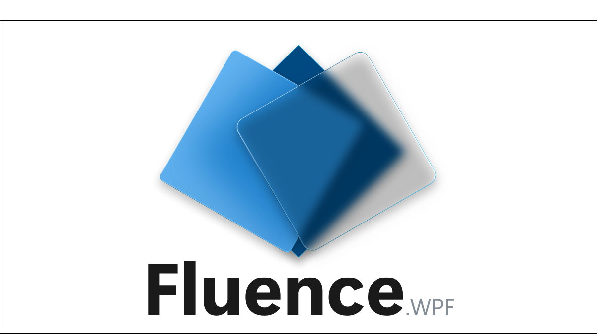

# Fluence.Wpf

Windows 11 Fluent Design controls and theming for WPF applications targeting **.NET Framework 4.7.2** and **Windows 10** (1809+), with enhanced visuals on **Windows 11**.



## Features

- **Theme pipeline** - Light, Dark, High Contrast, and Auto (follow Windows app theme) with stable `MergedDictionaries` ordering and no dictionary accumulation.
- **Accent colors** - System accent palette, app-defined accent, and custom accent ramps mapped to WinUI-style resource keys.
- **System theme watcher** - Refresh resources when the user changes Windows theme or accent at runtime.
- **FluenceWindow** - DWM **Mica**, **Acrylic**, and **Tabbed** backdrops; rounded corners; minimize / maximize / close button overrides; extensible title bar for a WinUI-style search box or custom content.
- **Controls** - Fluent-styled Button, HyperlinkButton, DropDownButton, CheckBox, RadioButton, ToggleSwitch, TextBox, PasswordBox, ComboBox, Slider, NumberBox, ProgressBar, ProgressRing, ListView, ListBox, Expander, Card (clickable), InfoBar, InfoBadge, NavigationView, FontIcon, Border, StackPanel, DockPanel, SmoothScrollViewer, plus TabControl / TabView / ScrollBar themes.
- **TabView** - Multi-document surface over `TabControl` with per-tab close (`CloseRequested` / `TabCloseRequested`), trailing add-tab button (`AddTabButtonClick`), per-tab icons, `TabWidthMode`, `CloseButtonOverlayMode`, and horizontal overflow scroll.
- **NavigationView** - `Top`, `Left`, and `LeftCompact` pane modes with animated shared selection indicator, pane toggle + back button in the 48 px rail, and WinUI 3 content-region border (`CornerRadius="8,0,0,0"`, `CardStrokeColorDefault` top/left stroke).
- **Typography** - Attached properties on `TextBlock` for the WinUI type ramp (Caption / Body / BodyStrong / Title / TitleLarge / Display).
- **Demo app** - Full gallery for visual verification: theme swatches, accent picker, backdrops, per-control pages (including a dedicated Tabs page), and a title-bar search that filters the nav.
- **Tests** - MSTest suite covering theme stability, accent resolution, window policy, template parts, and control behavior (including `TabView` close / add-tab routing).

## Quick Start

1. Add a project reference to `Fluence.Wpf` (or reference the built `Fluence.Wpf.dll`).
2. In `App.xaml.cs` (before showing the main window):

```csharp
Fluence.Wpf.ApplicationThemeManager.Apply(
    Fluence.Wpf.ApplicationTheme.Auto,
    Fluence.Wpf.BackdropType.Mica,
    updateAccent: true);
Fluence.Wpf.ApplicationAccentColorManager.ApplySystemAccent();
```

1. Use `Fluence.Wpf.Controls.FluenceWindow` (or merge `Generic.xaml` and use styled controls in a standard `Window`).

Optional XML namespace mapping:

```xml
xmlns:fluence="http://schemas.fluencewpf.com"
```

## Screenshots

The banner above is checked in at `docs/images/Banner.png`. Theme-specific gallery captures live under `docs/screenshots/` (`banner-{light|dark|highcontrast}-{1|1.5}x.png`) and are regenerated via the opt-in `GalleryScreenshotHarness` MSTest (`FLUENCE_CAPTURE_SCREENSHOTS=1 dotnet test -f net472 --filter "FullyQualifiedName~GalleryScreenshotHarness"`); see [docs/controls.md](docs/controls.md#screenshots) for details. Per-control screenshots for [docs/controls.md](docs/controls.md) are collected under `docs/images/`; capture at 100 % and 150 % scaling when documenting layout-sensitive controls.

## Controls

| Area        | Types                                                                                                                       |
|-------------|-----------------------------------------------------------------------------------------------------------------------------|
| Window      | `FluenceWindow`,                                                                                                            |
| Basic input | `Button`, `HyperlinkButton`, `DropDownButton`, `CheckBox`, `RadioButton`, `ToggleSwitch`, `ComboBox`, `Slider`, `NumberBox` |
| Text        | `TextBox`, `PasswordBox`, `TextBlockExtensions`                                                                             |
| Collections | `ListView`, `ListBox`                                                                                                       |
| Tabs        | `TabControl`, `TabItem`, `TabView`, `TabViewItem`                                                                           |
| Feedback    | `ProgressBar`, `ProgressRing`, `InfoBar`, `InfoBadge`                                                                       |
| Navigation  | `NavigationView`, `NavigationViewItem`                                                                                      |
| Layout      | `Card`, `Border`, `StackPanel`, `DockPanel`, `SmoothScrollViewer`, `Expander`                                               |
| Icons       | `FontIcon`                                                                                                                  |

## Theming

- **ApplicationTheme**: `Light`, `Dark`, `HighContrast`, `Auto`.
- **BackdropType**: `None`, `Auto`, `Mica`, `Acrylic`, `Tabbed` (for `FluenceWindow`).
- **Accent**: `ApplicationAccentColorManager.ApplySystemAccent()`, `ApplyApplicationAccent()`, or `ApplyCustomAccent(Color)`.
- **Live OS changes**: `SystemThemeWatcher.Watch(window)` / `UnWatch(window)`.

## Installation

Clone or submodule this repository and add a **project reference** to `Fluence.Wpf/Fluence.Wpf.csproj`.

A **NuGet** package id **`Fluence.Wpf`** is reserved for a future publish. Until then, use a project reference or a local package:

```powershell
dotnet pack Fluence.Wpf/Fluence.Wpf.csproj -c Release -o ./artifacts
```

## Requirements

- .NET Framework 4.7.2 and/or .NET 10 (Windows) - see the solution TFMs
- Windows 10 version 1809 or later
- Windows 11 recommended for full Mica / Acrylic / Tabbed backdrop support

## Building from Source

Prerequisites: [.NET SDK](https://dotnet.microsoft.com/download) (includes MSBuild), Windows.

```powershell
dotnet restore Fluence.Wpf.sln
dotnet build Fluence.Wpf.sln -c Release
dotnet test Fluence.Wpf.sln -c Release
```

## Running the Demo

```powershell
dotnet run --project Fluence.Wpf.Demo/Fluence.Wpf.Demo.csproj -c Release
```

Or set **Fluence.Wpf.Demo** as the startup project in Visual Studio and press F5.

## Documentation

- [Getting started](docs/getting-started.md) - reference, startup calls, local pack
- [Theming](docs/theming.md) - merge order, accent, backdrop, watcher
- [Controls](docs/controls.md) - catalog aligned with the demo gallery
- [Migration guide](docs/migration-guide.md) - generic move from other Fluent-style stacks
- [Contributing](docs/contributing.md) - build matrix, tests, PR notes

## Contributing

Pull requests are welcome. Please keep **C# 7.3** compatibility on `net472` and match existing patterns for themes and controls. For AI-assisted edits, read [CLAUDE.md](CLAUDE.md) and [.github/copilot-instructions.md](.github/copilot-instructions.md).

## License

Licensed under the [BSD 3-Clause License](LICENSE).

Copyright © 2026 Dan Cunningham.
