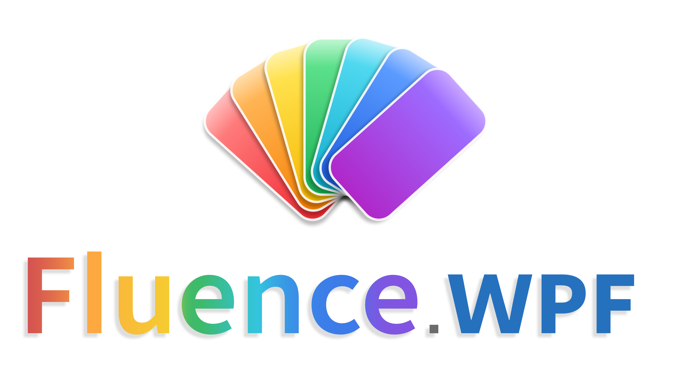

# Fluence.Wpf



## Introduction

Fluence.Wpf brings native Windows 11-style (Fluent) windows and controls - including automatic light / dark mode and customisable accent colors - without requiring you to rewrite your app for WinUI or upgrade to the latest .NET release. It comes as a NuGet package for C# developers, and a handy PowerShell module for administrators who need to create modern user experiences. 

It uses WPF natively and targets **.NET Framework 4.7.2**, **.NET 8**, and **.NET 10** on **Windows 10 (1809+) and above**, without any additional runtime dependencies, for example, the Windows App SDK. That means an air-gapped machine with a vanilla install of Windows 10 is a supported (and highly unlikely) scenario!

[](https://www.nuget.org/packages/Fluence.Wpf) [](https://github.com/sintaxasn/Fluence.Wpf/releases/latest) [](https://github.com/sintaxasn/Fluence.Wpf/actions/workflows/build.yml) [](LICENSE) [](#requirements)

## Choose a starting point

| If you are ... | Start here |
| --- | --- |
| ... building a WPF app in C# or XAML | [C# basic walkthrough](https://fluencewpf.com/docs/csharp/usage), then the [control catalog](https://fluencewpf.com/docs/controls) |
| ... writing a Windows PowerShell or PowerShell 7 scripting | [PowerShell basic usage](https://fluencewpf.com/docs/powershell/usage), then the [functions reference](https://fluencewpf.com/docs/powershell/reference) |
| ... contributing | [Contributing](CONTRIBUTING.md) and the [developer handbook](AGENTS.md) |

The [documentation site](https://fluencewpf.com) links tutorials, task guides, reference pages, and explanations. Its source is maintained separately in the [Fluence.Wpf.Website repository](https://github.com/sintaxasn/Fluence.Wpf.Website).

## Screenshots

| Gallery home                                                 | Gallery buttons                                              | MVVM task manager                                            | PowerShell Controls Tour                                     |
| ------------------------------------------------------------ | ------------------------------------------------------------ | ------------------------------------------------------------ | ------------------------------------------------------------ |
| <br>Light | <br>Light | <br>Light | <br>Light |
| <br>Dark | <br>Dark | <br>Dark | <br>Dark |


## Use the library

Apply a theme before showing the first window:

```csharp
using Fluence.Wpf;

ApplicationThemeManager.Apply(ApplicationTheme.Auto, WindowBackdropType.Mica);
```

In XAML, add `xmlns:fluence="http://schemas.fluencewpf.com"` and use a Fluence control:

```xml
<fluence:Button Content="Continue" Appearance="Accent" />
```

The [C# basic usage guide](https://fluencewpf.com/docs/csharp/usage) builds a full window. The [control catalog](https://fluencewpf.com/docs/controls) lists the controls, and the [theming guide](https://fluencewpf.com/docs/theming) documents the shared resources.

`ApplyCustomAccent` uses a snapshot of the Windows accent palette when its seed matches the current Windows accent; other custom seeds use a generated ramp. When a brand color must be the visible primary fill, use `ApplicationAccentColorManager.ApplyCustomAccentExact(lightColor)` or pass both light and dark colors to `ApplyCustomAccentExact(lightColor, darkColor)`. See the [accent guide](docs/theming.md#accent-backdrop-and-design-time) for examples.

## Use the PowerShell module

Build the library, then stage the module's assemblies:

```powershell
dotnet build Fluence.Wpf/Fluence.Wpf.csproj -c Release
pwsh -NoProfile -File Fluence.Wpf.PowerShell.Module/build/Build-Module.ps1 -Configuration Release
```

Follow [PowerShell basic usage](https://fluencewpf.com/docs/powershell/usage) for import and a first dialog. The module supports Windows PowerShell 5.1 and PowerShell 7.4 or later, with dialogs, forms, progress, and full windows. The [functions reference](https://fluencewpf.com/docs/powershell/reference) lists the exported commands.

## Explore the demos

```powershell
dotnet run --project Fluence.Wpf.Demo/Fluence.Wpf.Demo.csproj -c Debug -f net10.0-windows10.0.26100.0
dotnet run --project Fluence.Wpf.Demo.Mvvm/Fluence.Wpf.Demo.Mvvm.csproj -c Debug
```

The [gallery](Fluence.Wpf.Demo/README.md) shows controls and example source. The [MVVM demo](Fluence.Wpf.Demo.Mvvm/README.md) shows a task manager built with CommunityToolkit.Mvvm. PowerShell examples live in [the module examples](Fluence.Wpf.PowerShell.Module/examples/README.md).

## Project information

- [Documentation site](https://fluencewpf.com)
- [Documentation website source](https://github.com/sintaxasn/Fluence.Wpf.Website)
- [Changelog](CHANGELOG.md)
- [Known issues](KNOWN_ISSUES.md)
- [Roadmap](docs/roadmap.md)
- [Support](SUPPORT.md)
- [Security policy](SECURITY.md)
- [License](LICENSE)
